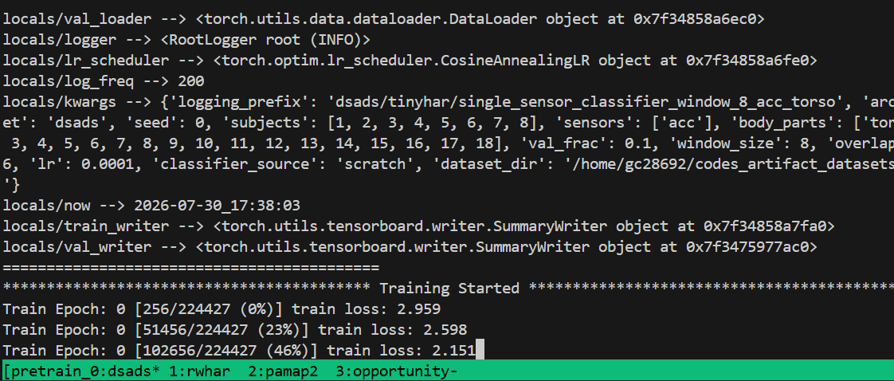

# BHAR: A System-Level Optimization Framework for Multisensor Batteryless Human Activity Recognition
Accepted Paper [PDF](./CODES_2026_BHAR_accepted.pdf)

# Overview
This repository contains the source code for BHAR: A System-Level Optimization Framework for Multisensor Batteryless Human Activity Recognition.

The following includes a detailed description of the requirements, set up instructions, and code to run in order to replicate the results of the paper.

# What is Reproduced
This code repository reproduces the empirical results in Section 5 of the [paper](./CODES_2026_BHAR_accepted.pdf) (*Empirical Results and Ablations*). Specifically, the results used to create Fig. 3 and Fig. 6-12. While the manuscript has a hardware component, it is only used to obtain numerical values for the system parameters we use in our framework (Table 2). This hardware component (shown in Fig. 4) is not required in order to replicate the results of the paper's methodology, as it only represents a particular instantiation of the system.

Overall, this artifact represents the implementation of the core methodology and experiments of the paper. It has the code to pretrain HAR classifier's, optimize data acquisition policies, emulate batteryless sensor streams, finetune HAR classifier's for sparse, asynchronous data streams, result logging, and figure creation.

# High Level Steps to Reproducing Paper Results
The following steps give a high level outline of how to reproduce the paper results before we go into detailed step by step instructions:

1. Before continuing, open the [`REQUIREMENTS.md`](./REQUIREMENTS.md) file to make sure you have the necessary machine and system tools to run the code (standard Linux setup for Python and training deep learning models).
2. Follow the [`INSTALL.md`](./INSTALL.md) instructions to download the datasets and set up the environment needed to run all the code.
3. Follow the detailed step by step instructions later in this README file Run to train and evaluate the models for batteryless human activity recognition. This will generate all the results and logs needed to reproduce the plots.
4. Finally, run the code to generate the figures from the test results which represents the final outputs shown in the paper.

# Directory Structure
We provide a high-level breakdown of the directories in this code repository. **Make sure you install this repo in your home directory (~) for the code to run successfully (~/BHAR_codes_artifact).**

**Root Directory**  
The current directory (BHAR_codes_artifact) is referred to as the *root* directory of the project. It is the top level directory where all the other files fall under (other than the raw dataset files which are installed in a separate directory as explained in [`INSTALL.md`](./INSTALL.md)). At the top level we have the documentation markdown files ([`README.md`](./README.md), [`REQUIREMENTS.md`](./REQUIREMENTS.md), [`INSTALL.md`](./INSTALL.md)), license ([`LICENSE`](./LICENSE)), dependency specification ([`pyproject.toml`](./pyproject.toml)), and the accepted paper [PDF](./CODES_2026_BHAR_accepted.pdf). There is also a directory_config.yaml file which specifies the paths to the downloaded datasets. Please do not modify these paths. It is assumed that you will follow the dataset installation instructions without changing the default directory locations.

**dataset_installation**  
This folder has a few bash scripts used during the installation phase to install the HAR datasets used in the experiments.

**datasets**  
This folder has several python files that contain all the code used for anything dataset related. For example, defining PyTorch datasets and dataloaders, preprocessing the HAR data, etc.

**energy_harvesting**  
This folder has a few python utility files that are used to emulate a batteryless sensor based on the system parameters we obtained from hardware profiling.

**experiments**  
This is the main folder where the code runs from. We have all the python training scripts for classifier and policy optimization. We also have a *pretraining_scripts* folder which contains the bash scripts that define all the configurations used to run our pretraining experiments. We also have a *posttraining_scripts* folder which contains the bash scripts that define all the configurations used to run our posttraining experiments.

**models**  
This folder define all the model architectures used for our HAR classifiers.

**saved_data**  
This folder gets generated when runnning experiments. It contains all the logs and saved results.

#### **saved_data_cached**  
To make reproducing the experiments easier, we provide all the checkpoints and results we used to obtain our final result figures at this [link](https://zenodo.org/records/21812226). Download and extract this ZIP to **~/BHAR_codes_artifact/saved_data_cached.** Any subset of these can be used to speed up the process to avoid having to rerun all training scripts from scratch (which takes up to several days).

**utils**  
This folder contains some general utils (setting up the logger and random seeds) as well as a series of python files used to generate the figures in the paper from the saved_data.

---

# Reproducing the Results Step by Step Instructions

## 1. [`REQUIREMENTS.md`](./REQUIREMENTS.md)
- Verify you have the requirements needed to run this code (tmux, nvidia-smi drivers, Jupyter notebook etc.).

## 2. [`INSTALL.md`](./INSTALL.md)
- Run the installation instruction step by step to set up the conda environment and download the datasets.

## 3. Training

### 3.1 Pretraining
The pretraining phase consists of pretraining all single sensor classifiers and multisensor classifiers on the dense data across all datasets, seeds, and subjects.

To run all pretraining, go to experiments directory and execute the pretrain all script:
```
cd ~/BHAR_codes_artifact/experiments/pretraining_scripts
./pretrain_all.sh
```

This will open a tmux session with 4 windows (1 per dataset). For each window we execute a series of bash scripts which each train a sequence of models across all combinations of architecture, seed, and subject (LOSOCV). This is what you should see in the terminal:



Given that pretraining takes a very long time to run (many experiments need to be run to iterate across all datasets, seeds, architectures, and subjects), we provide the checkpoints of all the pretrained models under the **saved_data_cached** folder (see the [saved_data_cached section](#saved_data_cached)). This will allow you to run the post-training scripts without needing to wait for pretraining to finish.

It is also helpful to understand how the **saved_data** folder gets populated. It has folders for checkpoints (saved model/policy parameters), logs, results (output metrics on test set), as well as a runs folder for tensorboard files. Each experiment is represented by a path: [dataset_name]/[architecture_name]/[experiment_name]/[subject]_seed[seed].[file extension]. This organizes the experiment outputs based on the dataset, architecture, method, subject, and seed.

If you want to skip pretraining and use the cached pretrained model checkpoints, then in train_har_policy.py (under experiments folder), make the default for the --pretrain_source arg equal to "cached". This will use the cached pretrained models for policy optimization, finetuning, and evaluation.

### 3.2 Posttraining
The post training phase consists of policy optimization, model finetuning, and evaluation. To run all posttraining, go to experiments directory and execute the posttrain all script:
```
cd ~/BHAR_codes_artifact/experiments/posttraining_scripts
./posttrain_all.sh
```

Similar to pretraining, this will open a tmux session with 4 windows (1 per dataset). Again, this phase also takes a long time to run so checkpoints and results are provided in the saved_data_cached folder.

Again, if you skipped pretraining and want to use the cached pretrained model checkpoints, then in train_har_policy.py (under experiments folder), make the default for the --pretrain_source arg equal to "cached". This will use the cached pretrained models for policy optimization, finetuning, and evaluation.

However, if you did not skip pretraining, and ran the full experiments that populate the saved_data folder, then make the default for the --pretrain_source arg equal to "current". This will use the checkpoints generated from the current pretraining runs.

If you want to skip posttraining and use cached finetuned models then set the default for the --finetune_source arg equal to "cached". Otherwise set it to "scratch" to finetune it. (you must also specify this in train_har_policy_heur.py for the --classifier_source arg to determine if you want to train the comparison method in Fig. 12 from scratch or use the cached version).

**Currently, the defaults are set to "scratch" so that pre/post training will run from scratch**
- a reccommended workflow might be to use the pretrained models and only train the policies and finetune the models. To do this, skip pretraining, and set --pretrain_source to cached in train_har_policy.py

## 4. reproducing the figures
To generate the figures, we use Jupyter notebooks under the **utils** directory. By default these use the saved_data_cached outputs. If you ran everything from scratch then you will need to change the path to saved_data folder.

### 1. Replicating Fig. 3
- Execute all the cells in data_visualization.ipynb

### 2. Replicating Fig. 6
- Execute all the cells in result_plots.ipynb

### 3. Replicating Fig. 7-10 and Fig. 12
- Execute all the cells in ablation_plots.ipynb

### 4. Replicating Fig. 11
- Execute all the cells in show_metrics.ipynb

**At this point you should have been able to generate all the empirical result figures from the paper and reproduced the results within a small margin of error.**